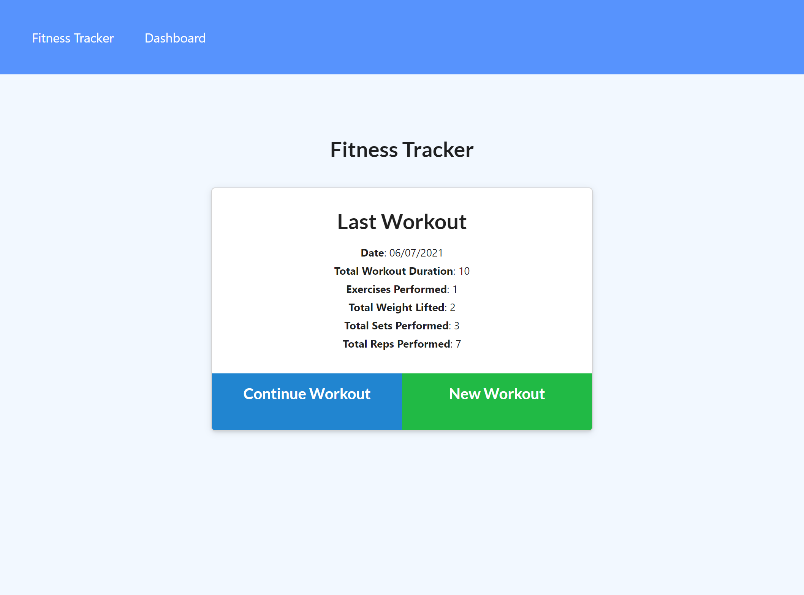
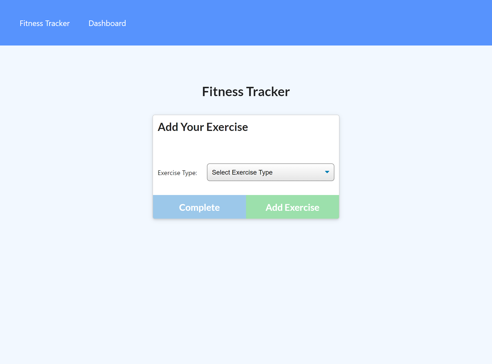
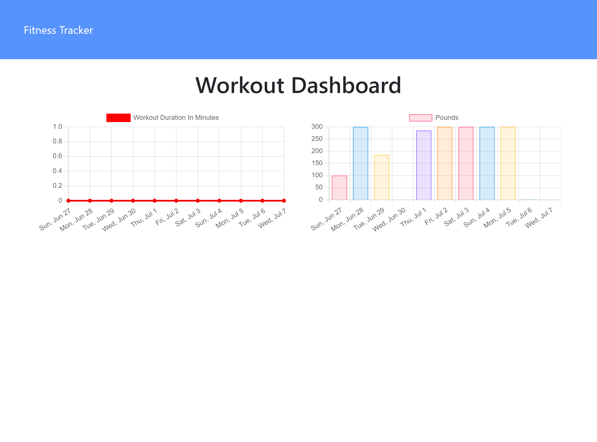

<h1 align="center"> Workout Tracker </h1>

<p align="center">
    
    
    
    
</p>

An app that will help gym lovers to reach their fitness goals more quickly when by tracking their workout progress.

## User Story
```
As a user, I want to be able to view create and track daily workouts. I want to be able to log multiple exercises in a workout on a given day. I should also be able to track the name, type, weight, sets, reps, and duration of exercise. If the exercise is a cardio exercise, I should be able to track my distance traveled.
```

## Acceptance Criteria

When a user loads the page, he/she should be given the option to create a new workout or continue with their last workout.

The user should be able to:
  * Add exercises to the most recent workout plan.
  * Add new exercises to a new workout plan.
  * View the combined weight of multiple exercises from the past seven workouts on the `stats` page.
  * View the total duration of each workout from the past seven workouts on the `stats` page.

## Table of Contents

- [User Story](#user-story)
- [Acceptance Criteria](#acceptance-criteria)
- [Table of Contents](#table-of-contents)
- [Packages](#packages)
- [Unique operations used](#unique-operations-used)
- [Repo link:](#repo-link)
- [HEROKU Deployed link:](#heroku-deployed-link)
- [Screenshots - Landing page](#screenshots---landing-page)
- [Screenshots - Exercise page](#screenshots---exercise-page)
- [Screenshots - Statistics page](#screenshots---statistics-page)
- [App Developer](#app-developer)


## Packages
  * [dotenv](https://www.npmjs.com/package/dotenv) *- Dotenv is a zero-dependency module that loads environment variables from a `.env` file into `process.env`.*
  * [express](https://www.npmjs.com/package/express) *- Fast, unopinionated, minimalist web framework for `node`.*
  * [mongoose](https://www.npmjs.com/package/mongoose) *- Mongoose is a MongoDB object modeling tool designed to work in an asynchronous environment. *
  * [morgan](https://www.npmjs.com/package/morgan) *- HTTP request logger middleware for node.js*
  * [shield-io](https://shields.io/) *- for readme file*

## Unique operations used
- [Upsert option as a single operation](https://docs.mongodb.com/drivers/node/fundamentals/crud/write-operations/upsert/)
 
## Repo link:
[Workout Tracker Repo 👋](https://github.com/marora7926/workout-tracker)

## HEROKU Deployed link:
[Workout Tracker Application](xx)

## Screenshots - Landing page


## Screenshots - Exercise page


## Screenshots - Statistics page


## App Developer
```
Mohit Arora
Email: mohitcoder2021@gmail.com
Repo: https://github.com/marora7926
```
- - -
© 2021 Mohit Arora. Confidential and Proprietary. All Rights Reserved.